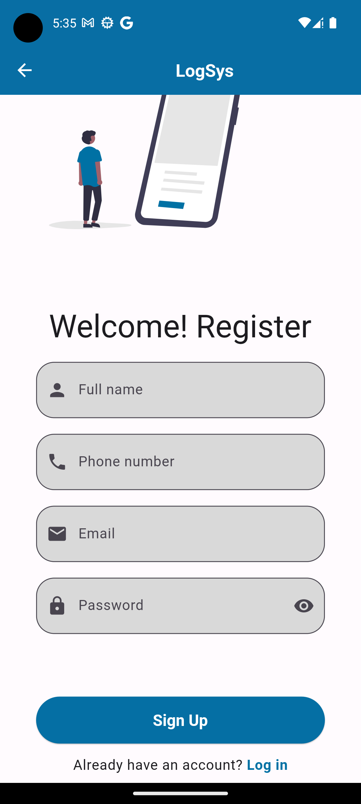
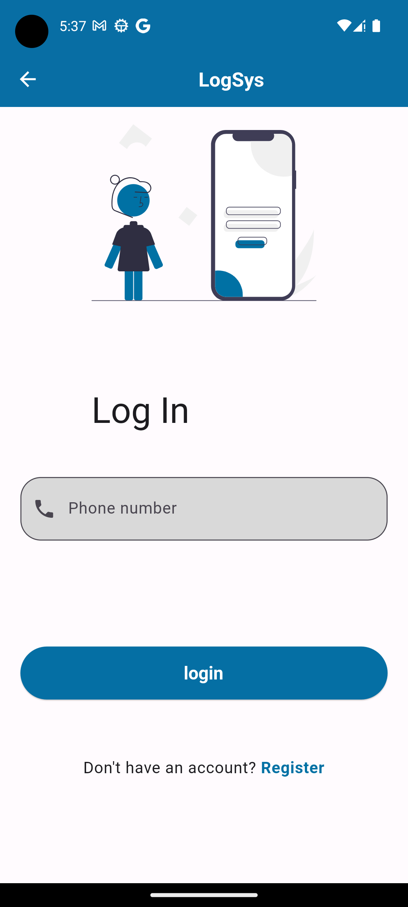
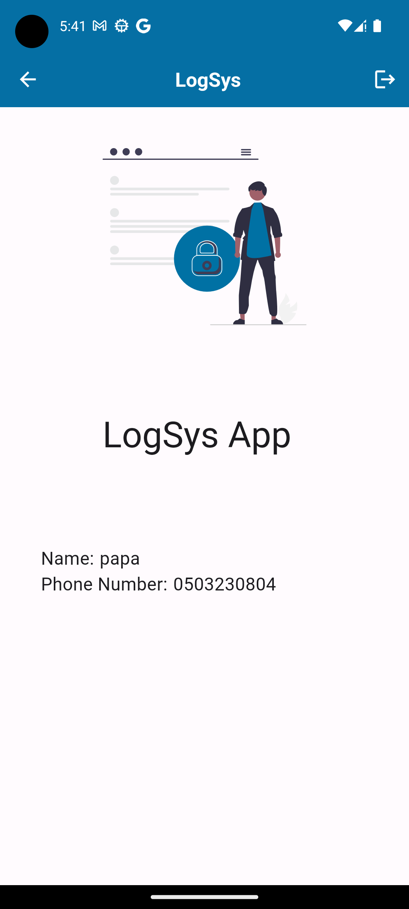
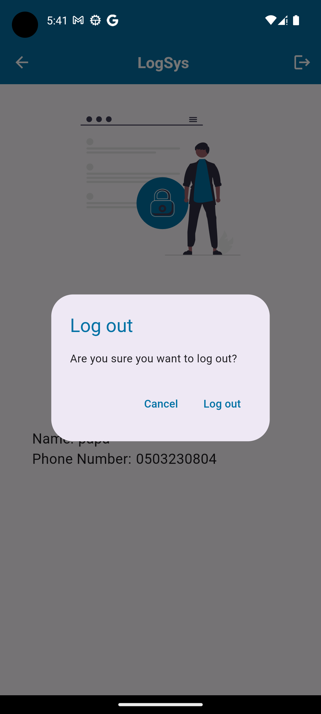
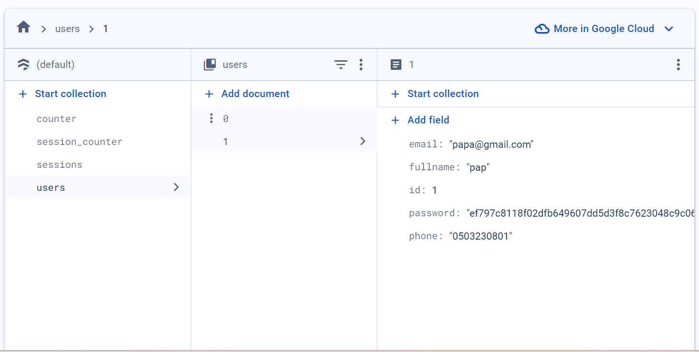

# _LogSys - Login System_

`LogSys` is a simple login system with session management.

## Application UI







## Firebase Integration (Firestore)


<br/>
I implemented a logic similar to how auto increment works of the id field of a user. A foreign key lies in each document[`user_id`] that creates a relationship with the user model for each session created.

### Database schema

```
Collection: users
  Document: {user_id}
    - full_name: "John Doe"
    - phone_number: "+123456789"
    - email: "john.doe@example.com"
    - hashed_password: "hashed_password_string"

Collection: sessions
  Document: {session_id}
    - user_id: "user_id_of_associated_user"
    - auth_token: "auth_token_string"
    - expiry_time: Timestamp
```

## Folder/File Structure

```
├───models
├───services
│   ├───database
│   ├───login
│   ├───register
│   └───sessions
├───utils
│   ├───constants
│   ├───dependency
│   └───theme
└───views
    ├───common_widgets
    ├───home
    │   └───widgets
    ├───login
    │   └───widgets
    └───register
        └───widgets
```

models - Models such as session model and user models. <br/>

services

- database - Database service to interact with the database.
- login - Login service to handle login related operations.
- register - Register service to handle register related operations.
- sessions - Sessions service to handle session related operations. <br/>
  utils
- constants - Constants such as app texts and colors etc.
- dependency - Dependency injection related files.
- theme - Theme related files. <br/>
  views
- common_widgets - Common widgets used in multiple views.
